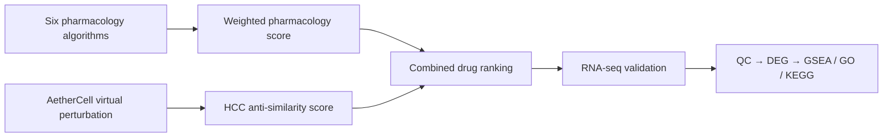

# DrugRep: drug repurposing for hepatocellular carcinoma

DrugRep is an early-stage research workspace for prioritizing established drugs for hepatocellular carcinoma (HCC) and validating selected candidates with bulk RNA-seq. It is a research project, not a clinical decision system.

## Project concept

The intended prioritization workflow has three connected stages:

1. **Computational pharmacology:** combine scores from six algorithms using a documented weighted average.
2. **Virtual perturbation:** use AetherCell to score anti-similarity between predicted drug perturbations and the HCC disease state.
3. **Experimental follow-up:** combine the two ranking signals, then characterize selected drug responses by RNA-seq quality control, differential expression, and pathway enrichment.

The present implementation covers stage 3. It analyzes four coded treatment groups (`NC`, `Sora`, `Spi`, and `Teg`) with three replicates each. `Sora` is documented as sorafenib; the full identities of `Spi` and `Teg` have not been confirmed and are therefore not inferred.



## Repository layout

- `PaperRef/`: project papers, including the AetherCell preprint.
- `data/`: local raw data, compact references, and processed analysis inputs.
- `analysis/`: configuration and the reproducible local pipeline.
- `results/`: generated figures, tables, and the run manifest.
- `reports/`: concise task reports plus advisor-facing materials under `reports/presentations/`.

Each important working directory contains a short README describing what belongs there. Large raw and reference files are intentionally ignored by Git and are recreated from the source archive or recorded reference downloads.

## Quick start

Python 3.10 or newer is recommended.

```bash
python3 -m venv .venv
source .venv/bin/activate
python -m pip install -r requirements.txt
python analysis/run_all.py \
  --archive /media/zzh/researchdata/seenHCC/Phase01_aetherCell/HCCDrug_RNAseq_core_tables_20260724_133204.tar.gz \
  --config analysis/config.json
```

The first run downloads and caches compact gene-identifier and pathway reference files. Later runs can be forced offline with `--offline`. Use `--refresh-references` only when intentionally updating the reference snapshot.

## Current RNA-seq scope

The mentor-provided archive contains raw count matrices and normalized expression from RSEM, Salmon, and STAR; full and filtered DESeq2 contrasts; and edgeR/limma sensitivity tables. The local workflow uses RSEM DESeq2 as the primary result and treats the other outputs as robustness checks. It also produces iDEP-ready count and design files.

This dataset contains treatment-versus-control profiles only. It does **not** contain an HCC tumor-versus-normal disease signature, so the downstream analysis describes drug perturbations and their similarities; it cannot establish disease-signature reversal or clinical efficacy.

## Reproducibility and data policy

- Files below `data/raw/` are immutable inputs.
- External gene mappings and gene-set libraries are cached with names, retrieval times, and SHA-256 checksums.
- Statistical thresholds and seeds live in `analysis/config.json`.
- Every completed run writes `results/run_manifest.json` with source checksums, software versions, warnings, and output paths.
- Compact tables and figures may be committed; raw data and downloaded reference snapshots should not be committed.

## References

- Li W, Chen Y, Peng Z, et al. *AetherCell: A generative engine for virtual cell perturbation and in vivo drug discovery*. bioRxiv (2026). [doi:10.64898/2026.03.13.710968](https://doi.org/10.64898/2026.03.13.710968). This is a preprint and had not been peer reviewed in the supplied version.
- Ge SX, Son EW, Yao R. iDEP: an integrated web application for differential expression and pathway analysis of RNA-Seq data. *BMC Bioinformatics* 19, 534 (2018). [iDEP](https://bioinformatics.sdstate.edu/idep/)
- Fang Z, Liu X, Peltz G. GSEApy: a comprehensive package for gene set enrichment analysis in Python. *Bioinformatics* (2022). [GSEApy documentation](https://gseapy.readthedocs.io/)
