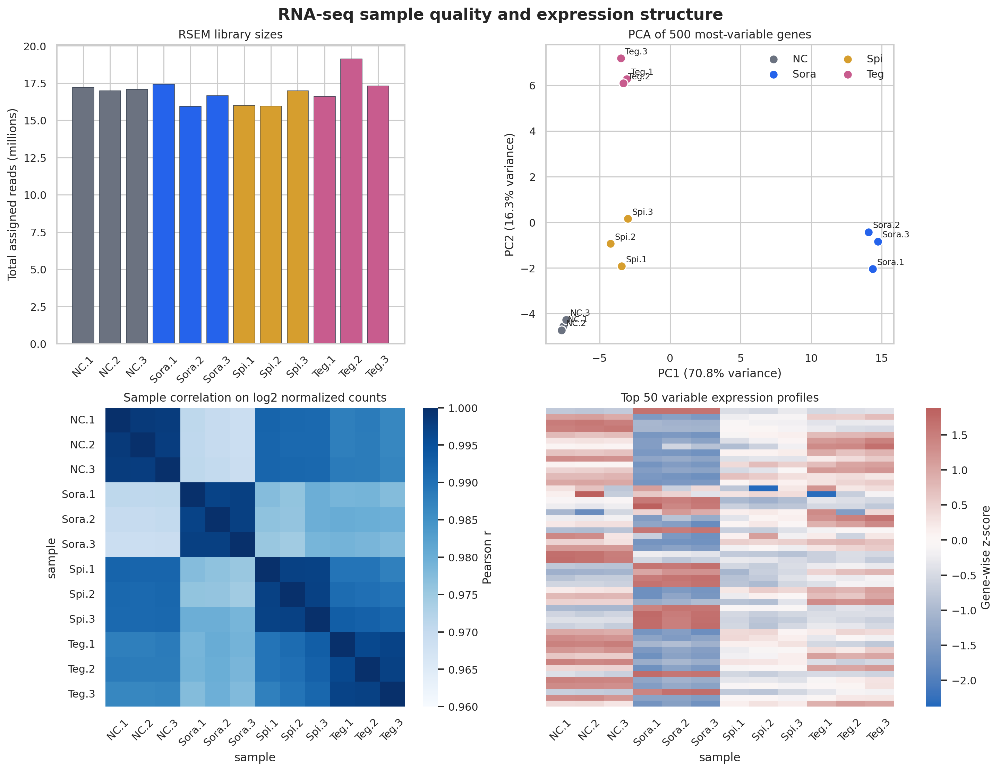
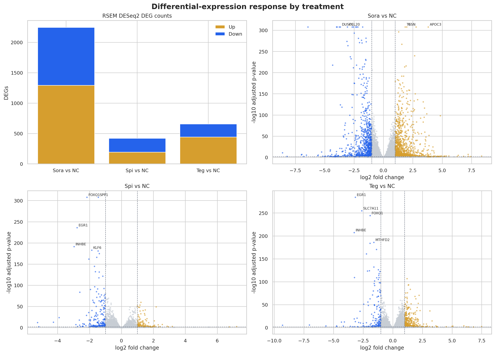
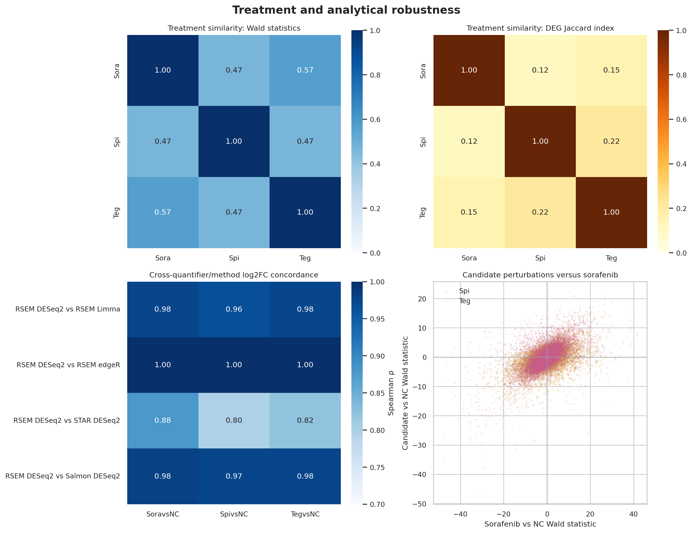
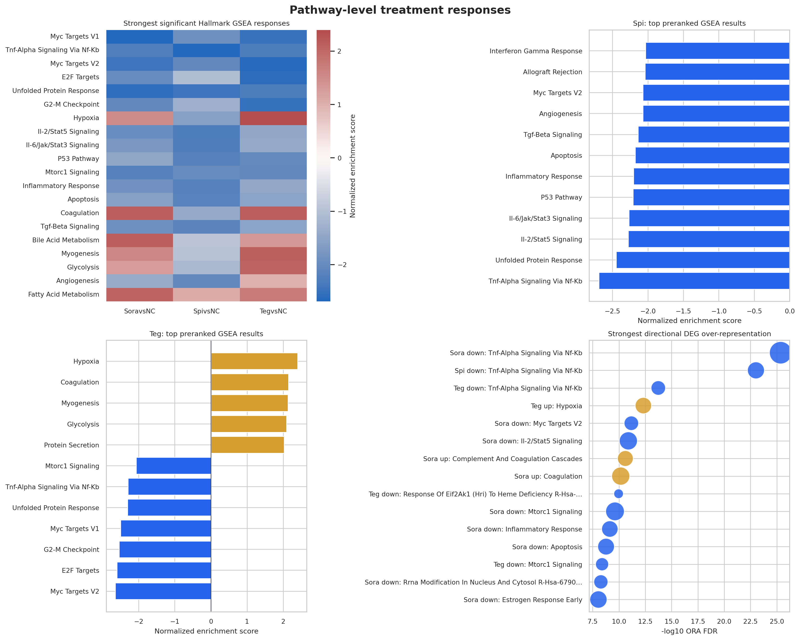

# HCC drug-treatment RNA-seq downstream analysis

## Technical summary

Raw dataset’s archive contains a usable and internally consistent RNA-seq pre-analysis for 12 samples: `NC`, sorafenib (`Sora`), and two coded candidates (`Spi`, `Teg`), each with three replicates. All archived files passed size and SHA-256 verification. The expression matrices, full DESeq2 results, filtered DEGs, and edgeR/limma sensitivity analyses are intact; only the final symbol/combined-annotation post-processing failed. The local GENCODE mapping covered at least 98.6% of tested genes, so the annotation failure did not block downstream analysis.

All four groups form tight, separate expression clusters with no heuristic sample outlier. Sorafenib produced the largest response (2,246 RSEM DESeq2 DEGs), followed by `Teg` (657) and `Spi` (421) at adjusted *p* `<0.05` and `|log2FC| ≥1`. `Teg` was more similar to sorafenib than `Spi` at both gene-statistic and pathway levels, while `Spi` showed a more distinct inflammatory/stress-response pattern. These similarities characterize perturbations only: they do not demonstrate HCC disease reversal, drug efficacy, or clinical benefit.

## RNA-seq Dataset completed core expression and DE analysis, but raw QC evidence is absent

| Stage | What is available | Assessment |
|---|---|---|
| QC and alignment | Pipeline/cluster logs mark both stages complete | FastQC/MultiQC and alignment summaries are absent, so read-level QC cannot be independently audited. |
| Expression | RSEM, Salmon, and STAR raw counts plus DESeq2-normalized matrices | All matrices contain the expected 12 samples and nonnegative numeric values. |
| Differential expression | 9 full DESeq2, 9 filtered DESeq2, and 18 edgeR/limma tables | Every filtered set was reproduced exactly from the full table at the documented thresholds. |
| Annotation post-processing | Error log: `unexpected else`; combined annotation files excluded | Core tables remain usable; local GENCODE release 49 mapping replaces this failed step. |

The RSEM library totals span 15.9–19.1 million assigned reads. PCA on the 500 most-variable log2-normalized genes separates all treatments: PC1 explains 70.8% of variance and PC2 explains 16.3%. Mean within-group correlations range from 0.9967 to 0.9981, comfortably above the predeclared 0.95 flagging threshold. Consequently, no sample was removed.

*Figure 1. RSEM library sizes, PCA, sample correlation, and the 50 most-variable expression profiles. Replicates remain close within groups, while each treatment has a distinct global profile.*

## Sorafenib produced the broadest response; Teg was intermediate and Spi was narrower

| Contrast | Tested genes | Upregulated DEGs | Downregulated DEGs | Total DEGs |
|---|---:|---:|---:|---:|
| Sora vs NC | 20,603 | 1,292 | 954 | 2,246 |
| Spi vs NC | 20,603 | 192 | 229 | 421 |
| Teg vs NC | 20,603 | 442 | 215 | 657 |

The DEG totals indicate response breadth rather than desirable activity. Sorafenib changes about 3.4 times as many genes as `Teg` and 5.3 times as many as `Spi`. Volcano plots show that all contrasts contain strongly supported genes in both directions, although the two candidates have fewer large positive changes. The archived filtered DEG tables match these regenerated counts exactly, confirming the mentor’s stated cutoff logic.

*Figure 2. RSEM DESeq2 DEG counts and volcano plots. Gold marks upregulated DEGs and blue marks downregulated DEGs at FDR `<0.05` and `|log2FC| ≥1`.*

Gene-level response estimates are robust. RSEM-versus-Salmon log2FC Spearman correlations are 0.974–0.981; RSEM-versus-STAR correlations are lower but still strong at 0.797–0.878. RSEM DESeq2 log2FC agrees almost perfectly with edgeR and at 0.964–0.976 with limma. Shared significant genes have 100% directional agreement in every method comparison. Hallmark GSEA is even more stable across quantifiers: NES correlations are 0.989–0.999 with complete sign agreement among exploratory pathways.

At the treatment level, sorafenib and `Teg` have the greatest gene-statistic similarity (Spearman ρ=0.568) and pathway-NES similarity (ρ=0.722). Sorafenib–`Spi` similarities are 0.467 and 0.366, respectively. `Spi`–`Teg` share the largest fraction of thresholded DEGs (Jaccard 0.215), but their pathway-NES correlation is only 0.239. Thus, DEG overlap alone would obscure important differences in how the full ranked transcriptomes organize into pathways.

*Figure 3. Cross-treatment gene statistics and DEG overlap, analytical-method concordance, and candidate perturbations relative to sorafenib. Similarity is descriptive and is not an efficacy score.*

## The candidates affect different biological programs

Preranked GSEA used the full signed DESeq2 Wald statistics, not the DEG subset. Positive NES means the gene set is concentrated toward genes higher under treatment versus `NC`; negative NES means concentration toward the lower-expression end. This should not automatically be translated into biochemical pathway activation or inhibition. Values reported as FDR 0 mean no equally extreme result occurred at the 1,000-permutation resolution, not a literal probability of zero.

| Treatment | Strong negative-ranked programs | Strong positive-ranked programs | Working interpretation |
|---|---|---|---|
| Sora | MYC targets, unfolded-protein response, TNFα/NF-κB, mTORC1, G2/M and E2F | Coagulation, bile-acid and fatty-acid metabolism | Broad suppression of proliferative/stress programs with a strong hepatocyte-metabolic shift. |
| Spi | TNFα/NF-κB, unfolded-protein response, IL-2/STAT5, IL-6/JAK/STAT3, p53, inflammatory response and apoptosis | A modest cholesterol-homeostasis signal | A narrower perturbation dominated by coordinated inflammatory and stress-response changes. Direction does not by itself imply benefit. |
| Teg | MYC targets, E2F, G2/M, DNA replication, unfolded-protein response and mTORC1 | Hypoxia, glycolysis, coagulation, protein secretion and myogenesis | A pronounced anti-proliferative transcriptional pattern accompanied by hypoxic/glycolytic and secretory adaptation. |

Leading-edge genes make these patterns auditable. Sorafenib’s negative MYC/UPR signals include `MYC`, `MCM` genes, `XBP1`, `ATF4`, and `HSPA5`, while positive metabolic sets include `APOA1`, `HNF4A`, `CYP7A1`, and fatty-acid oxidation genes. `Spi`’s negative inflammatory leading edges include `EGR1`, `JUN`, `CEBPB`, `NFKBIA`, `SOCS3`, and `IRF1`. `Teg`’s negative proliferation sets repeatedly include `MYC`, `MCM2-7`, `PLK1`, `CDC20`, and `CDK4`, whereas its positive hypoxia/glycolysis edge includes `PGK1`, `LDHA`, `PDK1`, `SLC2A1`, and `HK2`. Direction and protein-level consequence require experimental confirmation.

*Figure 4. Cross-treatment Hallmark NES, strongest candidate Hallmark results, and directional DEG over-representation. ORA used successfully mapped tested genes as its background; point size reflects overlap.*

## Methods, limitations, and robustness

RSEM DESeq2 is the primary analysis because explicitly designated it and supplied complete results. Salmon, STAR, edgeR, and limma were used as sensitivity analyses rather than combined into a new significance score. Ensembl IDs were mapped with GENCODE release 49; duplicate symbols retained the gene with largest absolute Wald statistic. GSEA used cached Hallmark, KEGG, Reactome, and GO Biological Process libraries, gene-set sizes 15–500, 1,000 permutations, and seed `20260820`. ORA analyzed up- and downregulated DEGs separately with the mapped DE-tested universe and Benjamini–Hochberg correction.

The main limitations are three replicates per group, unknown cell line/dose/exposure and batch metadata, coded candidate identities, and absence of raw read-level QC artifacts. The many related GO/Reactome results are not independent biological confirmations; pathway redundancy and shared genes can yield multiple significant labels for one underlying response. Most importantly, no tumor-versus-normal HCC signature was supplied. This analysis therefore cannot test disease-signature reversal and should not be merged directly with the AetherCell anti-similarity score as if it were an independent reversal measurement.

## Recommended next steps

1. Confirm the experimental metadata and drug identities with the mentor before assigning mechanisms.
2. Prioritize a small validation panel from robust leading edges: proliferation (`MYC`, `MCM2/5`, `PLK1`), stress/inflammation (`ATF4`, `XBP1`, `NFKBIA`, `SOCS3`), and the `Teg` hypoxia/glycolysis response (`SLC2A1`, `LDHA`, `PDK1`). Use qPCR or protein assays together with viability, apoptosis, and cell-cycle phenotypes.
3. Treat `Teg` as the candidate with greater sorafenib-like pathway convergence and `Spi` as a distinct inflammatory/stress perturbation. This is a follow-up design distinction, not a rank of clinical promise.
4. If an HCC tumor-versus-normal signature becomes available later, perform a separately specified reversal analysis using matched gene direction, tissue context, and an explicit null model.

## Questions for the mentor

- What are the full names and formulations of `Spi` and `Teg`?
- Which HCC cell line or model was used, and what were the dose and exposure duration?
- What genome build, GENCODE/Ensembl release, library preparation, and strandedness were used?
- Were samples randomized across library-preparation or sequencing batches, and is a batch covariate needed?
- Can the FastQC/MultiQC, alignment summary, and sample-sheet metadata be provided?

Full audit tables are in [`results/tables`](../results/tables/), iDEP-ready inputs are in [`data/processed/idep`](../data/processed/idep/), and exact inputs, references, parameters, versions, checksums, and warnings are recorded in [`run_manifest.json`](../results/run_manifest.json).
